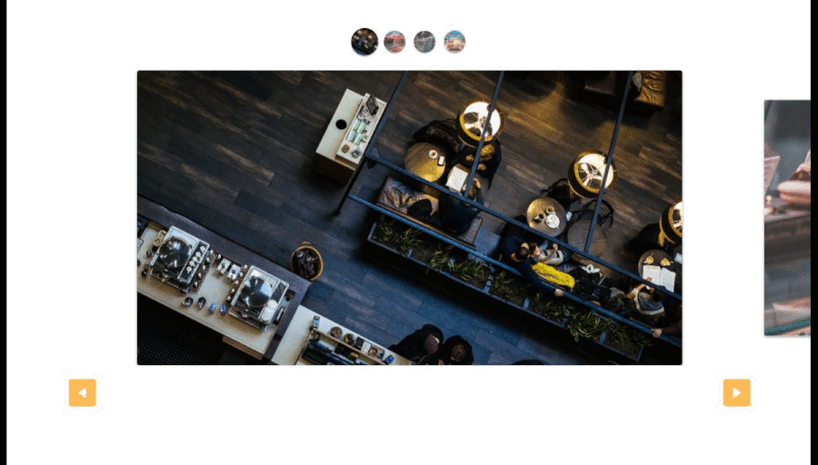

<p align="center">
  <a href="https://devfel.com/" rel="noopener">
 </a>
</p>

<h1 align="center">Picture Slider</h1>
<h3 align="center"> 🔗 Try it live at: https://devfel.github.io/slide-pictures/ </h3>

<div align="center">

[]()
[](/LICENSE)

</div>

---

<p align="center"> 
In this <b>responsive</b> project using HTML, CSS and Vanilla JavaScript I created a picture slider (a.k.a. as photo slider) to show several pictures and the user can slide through them using different ways, arrows, hold and drag or image clicking</p>
  <p align="center">
  <a href="" rel="noopener">
 </a>
</p>

---

## 📝 Table of Contents

- [Test Here](#live)
- [Application Features](#features)
- [Getting Started](#getting_started)
- [Dependencies](#dependencies)
- [Built Using](#built_using)
- [Acknowledgements](#acknowledgements)
- [Liceses](#licenses)
- [Authors](#authors)

---

## 🕹 Test Here <a name = "live"></a>

https://devfel.github.io/slide-pictures/

---

## 🧐 Application Features <a name = "features"></a>

- **_Show Images:_** The application is capable of showing several images.
- **_Hold and Drag:_** The user can hold an image and drag to the next or previous one. 
- **_Arrows:_** The user can click arrows to go the next or previous images. 
- **_Miniature Selection:_** The user can click on a miniature picture to make it appears as the selected picture. 

---

## 🏁 Getting Started <a name = "getting_started"></a>

Because this was done using only HTML, CSS and JavaScript it can be replicated easily within your own browser without much trouble, just clone the project and you can run it with in your browser.

You can clone the repository through Command Prompt or Terminal just by typing:

```sh
git clone https://github.com/devfel/slide-pictures.git
```

or download the zip from the green **"Code"** button.

---

## 🔁 Dependencies <a name = "dependencies"></a>

This application was done with Vanilla Javascript using ECMAScript 6. 
No extra libraries or frameworks so, there is no dependencies to install.

---

## ⛏️ Built Using <a name = "built_using"></a>

- [JavaScript](https://www.javascript.com/) - Programming Language
- [HTML](https://pt.wikipedia.org/wiki/HTML) - Markup Language
- [CSS](https://en.wikipedia.org/wiki/CSS) - Style Sheets

---

## 🎉 Acknowledgement  <a name = "acknowledgements"></a>

- Application created based on examples done by [Origamid](https://www.origamid.com/).

---

## 📝 Liceses <a name = "licenses"></a>

- Distributed under the MIT License - see the [LICENSE.md](https://github.com/devfel/slide-pictures/blob/master/LICENSE.md) file for details.

---

## ✍️ Author <a name = "authors"></a>

- [@devfel](https://devfel.com/) - Luiz Flávio Felizardo

